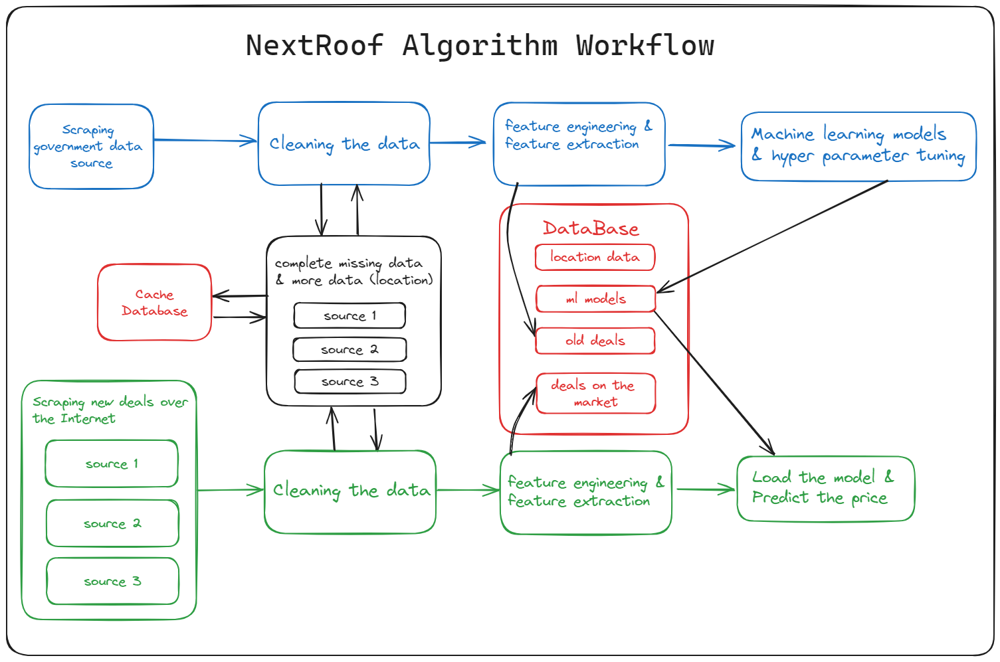

# NextRoof - Algorithm 

NextRoof revolutionizes real estate valuation in Israel with its cutting-edge web platform, 
leveraging Machine Learning for precise estimates. Beyond mere valuation, NextRoof offers in-depth 
analysis of market trends by aggregating and processing data from diverse sources. At its heart lies a dynamic 
recommendation engine, fueled by advanced machine learning algorithms, ensuring adaptability to real-time market 
shifts. Our platform diligently updates with the latest market data daily, processed and stored in a secure 
cloud-based database. Users benefit from an intuitive calculator that mirrors the latest market dynamics for 
accurate property valuations and can explore up-to-the-minute deals directly on our site. This repository 
houses the pivotal algorithm that is the backbone of NextRoof, enabling its core capabilities.

**ETL and Data Optimization:**

**1. Data Extraction** - Collecting data from several sources and cross-checking data in order to obtain reliable and high-quality data.

**2. Data Cleaning** - The data underwent rigorous cleaning. We used techniques like regex and external websites for data completeness and removed any irrelevant data.

**3. Data Visualization** - This phase helped in data analysis, ensuring its reliability and quality.

**4. Feature Engineering** - We've refined our dataset to significantly improve our prediction models, positioning us ahead of the curve in real estate market forecasting.

**4. Machine learning** - After thorough research, we chose a stacking method combining algorithms like *RandomForestRegressor*, *CatBoostRegressor*, *XGBRegressor*, and *GradientBoostingRegressor*. A *LinearRegression* model serves as our meta-model.

**5. Market Deployment** - Our models, having been rigorously trained and tested, are primed for deployment, ready to forecast the most promising real estate opportunities available in the market.

## Tech Stack:
*Primary Development Language*: Python
*Libreris*: Pandas, Numpy, Matplotlib,Sklearn, Sqlalchemy and Xgboost, PyPlot, Regex, difflib, pytest

 **models MAE and R2 scores**
 

 

 

**Requirements**
To run this project, you will need:
Python 3.8 or higher

## link for the website
1. Visit [NextRoof]([www.nextroof.co.il](https://www.nextroof.co.il/))  https://www.nextroof.co.il/
