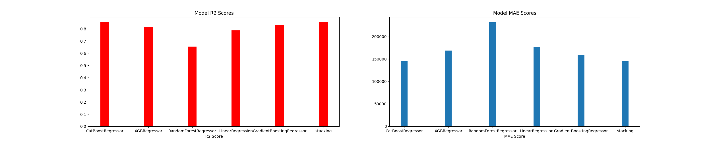

# NextRoof - Algorithm 

NextRoof is an innovative web platform that revolutionizes real estate valuation in Israel by utilizing Machine Learning. 
Central to NextRoof is a dynamic recommendation engine, driven by sophisticated machine learning algorithms that seamlessly adjust to market trends. 
Our system meticulously gathers the latest market data daily, processes it, and stores it in a cloud-based database. Users can effortlessly calculate up-to-date asset values using our calculator, reflecting the current market conditions, and explore the latest transactions directly on our website.
This repository is home to the essential algorithm that powers NextRoof's core functionalities.

**1. Data Collection** - Employed sophisticated methods for data extraction while evading blocks. This ensured rapid and clean data accumulation from multiple sources.

**2. Data Cleaning** - The data underwent rigorous cleaning. We used techniques like regex and external websites for data completeness and removed any irrelevant data.

**3. Data Visualization** - This phase helped in data analysis, ensuring its reliability and quality.

**4. Data Engineering** - Our secret sauce! Through extensive research, we optimized the dataset to significantly enhance our prediction models, surpassing other market leaders in real estate prediction.

**4. Machine learning** - After thorough research, we chose a stacking method combining algorithms like *RandomForestRegressor*, *CatBoostRegressor*, *XGBRegressor*, and *GradientBoostingRegressor*. A *LinearRegression* model serves as our meta-model.

**5. Market Deployment** - After training and testing the model is ready for the next stage to preidct the deals that avileble on the market

## Tech Stack:
*Primary Development Language*: Python
*Libreris*: Pandas, Numpy, Matplotlib,Sklearn, Sqlalchemy and Xgboost

 **models MAE and R2 scores*
 

 

 

**Requirements**
To run this project, you will need:
Python 3.11 or higher
Jupyter Notebook
Pandas, Numpy, Matplotlib, Sklearn, Xgboost, Sqlalchemy and Seaborn libraries

## link for the website
1. Visit [NextRoof]([www.nextroof.co.il](https://www.nextroof.co.il/))  https://www.nextroof.co.il/
