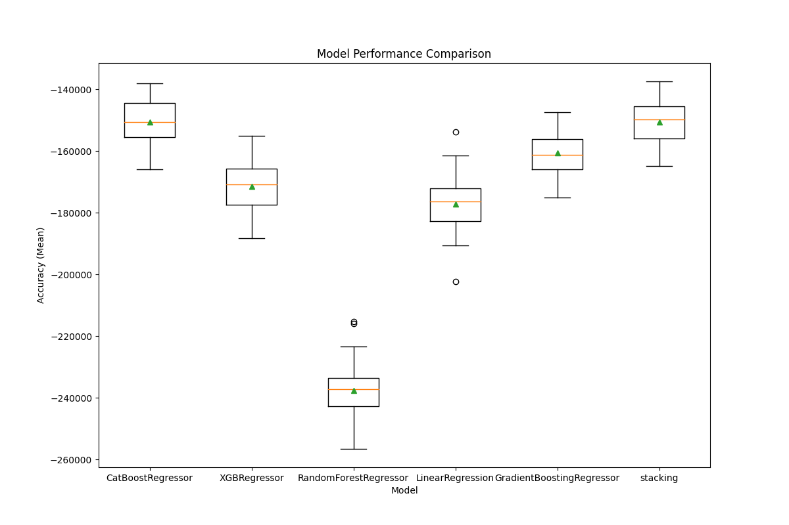

# NextRoof - Algorithm 

NextRoof is an advanced web platform leveraging artificial intelligence to provide real-time estimations for real estate asset values in Israel. At its heart, a dynamic recommendation engine is powered by intricate machine learning algorithms that adapt to market fluctuations. Additionally, our system actively highlights lucrative deals from various online sources. This repository is dedicated to the core algorithm behind NextRoof.

The development of the project followed these stages:

**1. Data Collection** - Employed sophisticated methods for data extraction while evading blocks. This ensured rapid and clean data accumulation from multiple sources.

**2. Data Cleaning** - The data underwent rigorous cleaning. We used techniques like regex and external websites for data completeness and removed any irrelevant data.

**3. Data Visualization** - This phase helped in data analysis, ensuring its reliability and quality.

**4. Data Engineering** - Our secret sauce! Through extensive research, we optimized the dataset to significantly enhance our prediction models, surpassing other market leaders in real estate prediction.

**4. Machine learning** - After thorough research, we chose a stacking method combining algorithms like *RandomForestRegressor*, *CatBoostRegressor*, *XGBRegressor*, and *GradientBoostingRegressor*. A *LinearRegression* model serves as our meta-model.

**5. Market Deployment** - After training and testing the model is ready for the next stage to preidct the deals that avileble on the market

## Tech Stack:
*Primary Development Language*: Python
*Libreris*: Pandas, Numpy, Matplotlib,Sklearn 

 **models MAE and R2 scores*
 

 

 

**Requirements**
To run this project, you will need:
Python 3.11 or higher
Jupyter Notebook
Pandas, Numpy, Matplotlib, and Seaborn libraries

## link for the website
1. Visit [NextRoof]([www.nextroof.co.il](https://www.nextroof.co.il/))  https://www.nextroof.co.il/

Contribution
We welcome contributions to the NextRoof project! If you have an idea for a new feature, or if you've found a bug that needs to be fixed, please open a new issue in the GitHub repository. We appreciate your help
